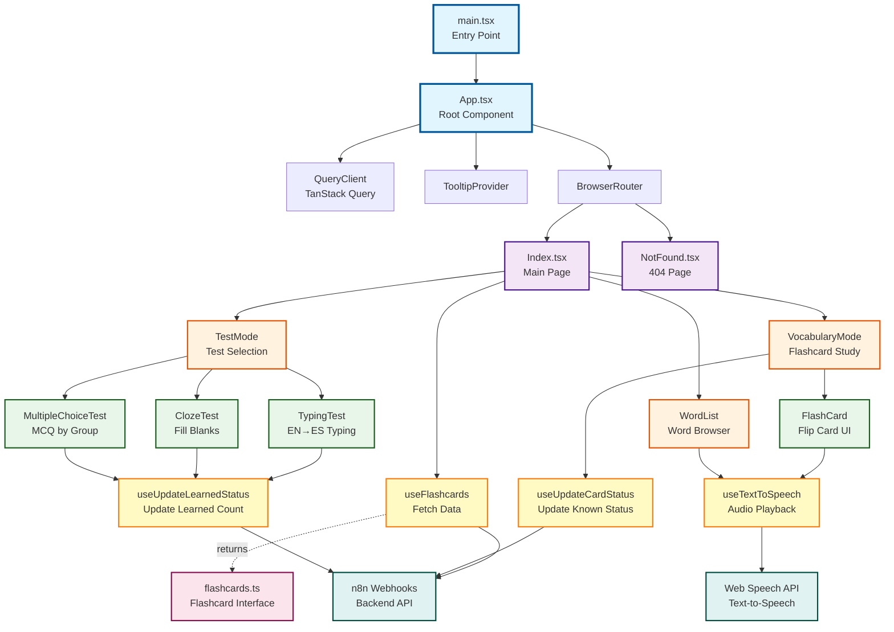
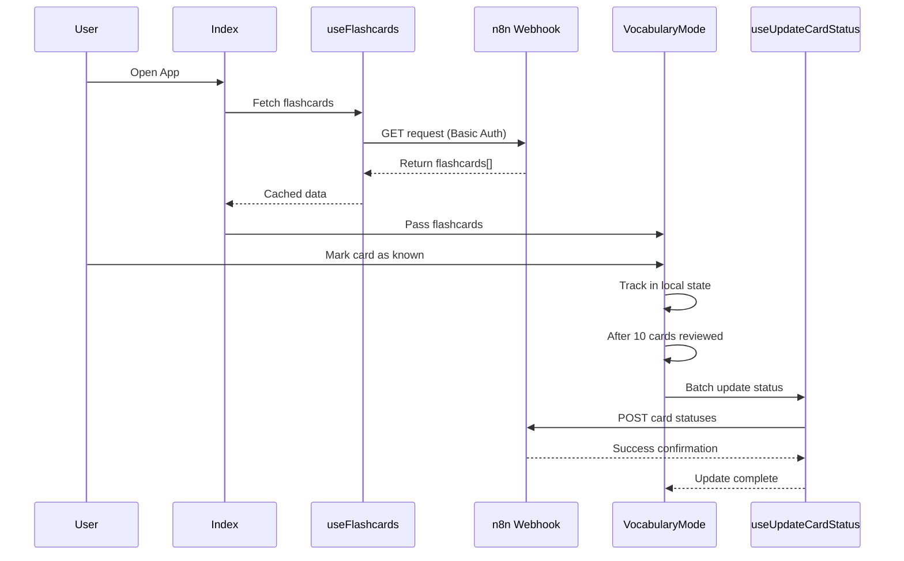

# Spanish Word Buddy - Code Graph & Architecture

## 📊 Visual Architecture Diagram



## 🏗️ Architecture Overview

### Application Structure

The Spanish Word Buddy is a React-based flashcard learning application with the following architecture:

#### **1. Entry Layer**
- **main.tsx**: Application entry point, renders the root App component
- **App.tsx**: Root component with providers and routing setup

#### **2. Provider Layer**
- **QueryClientProvider**: TanStack Query for data fetching and caching
- **TooltipProvider**: Shadcn/UI tooltip context
- **BrowserRouter**: React Router for navigation
- **Toast Components**: User notifications (Toaster, Sonner)

#### **3. Routing Layer**
- `/` → Index page (main application)
- `/*` → NotFound page (404 handler)

#### **4. Page Layer**
- **Index.tsx**: Main application page with mode switching
- **NotFound.tsx**: 404 error page

#### **5. Mode/Feature Layer**
Three primary learning modes:
- **VocabularyMode**: Interactive flashcard study with known/unknown tracking
- **TestMode**: Test selection hub
- **WordList**: Searchable word browser with difficulty grouping

#### **6. Test Components**
- **TypingTest**: English → Spanish typing practice
- **ClozeTest**: Fill-in-the-blank sentence completion
- **MultipleChoiceTest**: Multiple choice questions grouped by difficulty

#### **7. Shared Components**
- **FlashCard**: Reusable flip card with audio playback
- **UI Components**: Shadcn/UI component library (in src/components/ui/)

## 📦 Data Flow



### Data Flow Patterns

1. **Fetching Data**:
   - `useFlashcards` hook queries n8n webhook API
   - Uses Basic Authentication (credentials from env vars)
   - TanStack Query provides caching (15min stale time)
   - Data flows down to mode components as props

2. **Updating Data**:
   - User interactions tracked in local state
   - Batch updates every 10 cards to reduce API calls
   - Two update endpoints:
     - `useUpdateCardStatus`: Updates known/unknown status
     - `useUpdateLearnedStatus`: Updates learned count

3. **State Management**:
   - Local component state for UI interactions
   - TanStack Query for server state
   - No global state management (Redux/Zustand) needed

## 🎯 Component Relationships

### Index.tsx (Hub)
```
Index
├── useFlashcards (data fetching)
├── VocabularyMode (when activeMode === "vocabulary")
├── TestMode (when activeMode === "test")
└── WordList (when activeMode === "words")
```

### VocabularyMode
```
VocabularyMode
├── FlashCard (display component)
├── useUpdateCardStatus (status updates)
├── Local State:
│   ├── currentIndex (navigation)
│   ├── knownCards (Set<number>)
│   └── unknownCards (Set<number>)
└── Features:
    ├── Review priority algorithm
    ├── Progress tracking
    └── Batch updates (every 10 cards)
```

### TestMode
```
TestMode (router component)
├── TypingTest
├── ClozeTest
└── MultipleChoiceTest
    └── All use useUpdateLearnedStatus
```

### WordList
```
WordList
├── useTextToSpeech
├── Search functionality
├── Difficulty grouping
└── Collapsible sections
```

### FlashCard
```
FlashCard
├── useTextToSpeech (audio playback)
├── Flip animation
├── Optional action buttons
└── Usage examples display
```

## 🔌 Hooks & Custom Logic

### useFlashcards
- **Purpose**: Fetch flashcards from backend
- **Technology**: TanStack Query
- **Features**: 
  - Basic authentication
  - 15-minute cache
  - Automatic retry (1 attempt)
- **Returns**: `{ data, isLoading, error, refetch }`

### useUpdateCardStatus
- **Purpose**: Update known/unknown status
- **Type**: Mutation hook
- **Payload**: `CardStatus[]` with `row_number` and `known` boolean
- **Features**: Batch updates, error handling

### useUpdateLearnedStatus
- **Purpose**: Increment learned count after tests
- **Type**: Mutation hook
- **Payload**: Array of `{ row_number, learned }`

### useTextToSpeech
- **Purpose**: Spanish pronunciation using Web Speech API
- **Features**:
  - Prefers Google Spanish voice
  - Configurable rate and pitch
  - Speaking state tracking
- **Returns**: `{ speak, isSpeaking }`

## 📊 Data Model

### Flashcard Interface
```typescript
interface Flashcard {
  row_number: number;          // Unique identifier
  spanish: string;             // Spanish word/phrase
  english: string;             // English translation
  usage: string;               // Example sentence
  known?: boolean;             // User knows this word
  learned?: number;            // Times successfully recalled
  difficulty?: "easy" | "medium" | "hard";
  difficulty_score?: number;   // Numeric difficulty
  group?: string;              // Grouping for MCQ tests
}
```

## 🎨 Key Features

### 1. Review Priority Algorithm (VocabularyMode)
```typescript
review_priority = 
  +100 (if known=false)
  + (30 - learned) * 2  // Less learned = higher priority
  + difficulty_score * 3 // Harder = higher priority  
  - 20 (if learned >= 10) // Cap over-reviewed cards
```

### 2. Batch Update Strategy
- Reduces API calls by batching updates
- Triggers after every 10 card reviews
- Prevents excessive network traffic

### 3. Difficulty-Based Grouping
- Easy/Medium/Hard classification
- Used in WordList for organization
- Used in MultipleChoiceTest for similar-difficulty options

## 🌐 External Dependencies

### Backend Integration
- **n8n Webhooks**: Backend API service
- **Endpoints**:
  - GET: Fetch all flashcards
  - POST: Update card status
  - POST: Update learned count
- **Authentication**: HTTP Basic Auth

### Browser APIs
- **Web Speech API**: Text-to-speech for pronunciation
- **Local Storage**: (via TanStack Query cache)

## 🔧 Technology Stack

- **Framework**: React 18 + TypeScript
- **Build Tool**: Vite
- **Routing**: React Router v6
- **Data Fetching**: TanStack Query (React Query)
- **UI Library**: Shadcn/UI (Radix UI + Tailwind)
- **Styling**: Tailwind CSS
- **Icons**: Lucide React
- **Package Manager**: npm (with lock file)

## 📁 File Structure

```
spanish-word-buddy/
├── src/
│   ├── main.tsx                    # Entry point
│   ├── App.tsx                     # Root component
│   ├── pages/
│   │   ├── Index.tsx              # Main page
│   │   └── NotFound.tsx           # 404 page
│   ├── components/
│   │   ├── VocabularyMode.tsx     # Flashcard study mode
│   │   ├── TestMode.tsx           # Test selection
│   │   ├── WordList.tsx           # Word browser
│   │   ├── FlashCard.tsx          # Flip card component
│   │   ├── TypingTest.tsx         # EN→ES typing
│   │   ├── ClozeTest.tsx          # Fill-in-the-blank
│   │   ├── MultipleChoiceTest.tsx # MCQ test
│   │   └── ui/                    # Shadcn/UI components
│   ├── hooks/
│   │   ├── useFlashcards.ts       # Data fetching
│   │   ├── useUpdateCardStatus.ts # Status updates
│   │   └── useTextToSpeech.ts     # Audio playback
│   ├── data/
│   │   └── flashcards.ts          # TypeScript interfaces
│   └── lib/
│       └── utils.ts               # Utility functions
├── public/                         # Static assets
└── config files                    # Vite, TS, Tailwind, etc.
```

## 🔄 Component Lifecycle

### Application Startup
1. `main.tsx` renders `<App />`
2. App sets up providers (Query, Router, Tooltip, Toast)
3. Router loads `Index.tsx`
4. Index calls `useFlashcards` hook
5. Hook fetches data from API (cached for 15min)
6. Index renders VocabularyMode by default

### User Interaction Flow
1. User views flashcard in VocabularyMode
2. User marks card as known/unknown
3. Local state updates immediately (optimistic UI)
4. After 10 cards, batch update sent to API
5. Success/error feedback via console logs

### Mode Switching
1. User clicks tab in Index header
2. `activeMode` state updates
3. Index conditionally renders new mode component
4. Same flashcards data passed as props

## 🎯 Design Patterns Used

1. **Component Composition**: Reusable FlashCard in multiple contexts
2. **Custom Hooks**: Encapsulated logic (data fetching, TTS, updates)
3. **Render Props Pattern**: Conditional rendering based on mode
4. **Container/Presentational**: Index (container) vs FlashCard (presentational)
5. **Batch Processing**: Grouping updates to reduce API calls
6. **Optimistic UI**: Immediate feedback before API confirmation
7. **Memoization**: useMemo for filtered/sorted data (performance)

## 🔐 Security Considerations

- Basic Auth credentials stored in environment variables
- Credentials never committed to git (.env.example provided)
- HTTPS recommended for production API endpoints
- No sensitive data stored in browser (only learning progress)

## 📈 Performance Optimizations

1. **Query Caching**: 15-minute stale time reduces API calls
2. **Batch Updates**: Group status changes to minimize network requests
3. **useMemo**: Memoize expensive filtering/sorting operations
4. **Component Lazy Loading**: (could be added for test components)
5. **Optimistic Updates**: UI responds immediately without waiting

## 🚀 Future Enhancement Opportunities

Based on the architecture:
- Add more test types (listening comprehension, conjugation)
- Implement spaced repetition algorithm (SRS)
- Add offline support with service workers
- Export/import flashcard decks
- User authentication and multi-user support
- Statistics and progress dashboards
- Custom deck creation interface

---

Generated: January 2026
